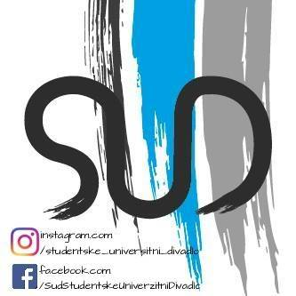
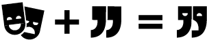

# Divadlo SUD #

*Divadlo Sud* is short for *Studentské universitní divadlo* (in Czech SUD means barrel), translated to English it means *Student University Theatre*. It is a small theater situated in a centre of a South Bohemian city České Budějovice.
 

*SUD* is an association established in 2002 by a group of enthusiastic university students. It is based on volunteering and the initiative of the members who participate in organizing various events, such as theatre, exhibitions, workshops, talks etc..The theatre is inclined to support young talented people and culturally enrich the society.

The old logo needed to modernise, due to the fact, that it had been used since 2002. The new visual identity had to be make, because they have worked just with the logo so far. Our goal was to make the theatre more visible and to attract new visitors.

 

I started my work by designing the logo. We wanted it to be playful, youthful and representing a theatre as itself. I started thinking about one motive that connects all forms of art together.
Then the glorious idea came! The connecting word is **the dialog!**
Because art, in any form, is a dialog. Either between the artists, between the artist and the viewer or between the viewers.
 

The offering motive for theatre was the theatre mask, of course. The dialogue represent the best, as I think, quotation marks. So let’s try to put these motives together. And *voilá*, what have we got? The new logo!

