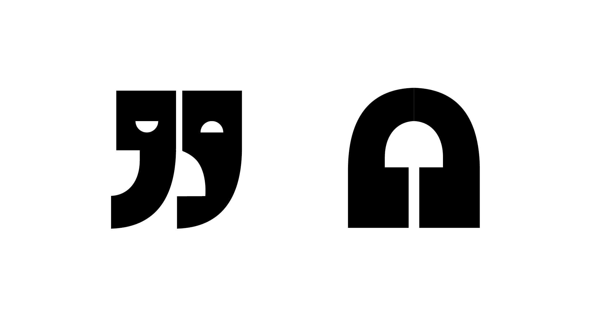

# Divadlo SUD #

*Divadlo Sud* is short for *Studentské universitní divadlo* (in Czech SUD means barrel), translated to English it means *Student University Theatre*. It is a small theater situated in a centre of a South Bohemian city České Budějovice.
 
 `A photo from theatre play.`

*SUD* is an association established in 2002 by a group of enthusiastic university students. It is based on volunteering and the initiative of the members who participate in organizing various events, such as theatre, exhibitions, workshops, talks etc..The theatre is inclined to support young talented people and culturally enrich the society.

The old logo needed to modernise, due to the fact, that it had been used since 2002. The new visual identity had to be make, because they have worked just with the logo so far. Our goal was to make the theatre more visible and to attract new visitors.

 

  

`Old logo.`

I started my work by designing the logo. We wanted it to be playful, youthful and representing a theatre as itself. I started thinking about one motive that connects all forms of art together.
Then the glorious idea came! 

*The connecting phrase is **the dialog!***

Because art, in any form, is a dialog. Either between the artists, between the artist and the viewer or between the viewers.
 
The offering visual element for theatre was the theatre mask, of course. The dialogue represent the best, as I think, quotation marks. So let’s try to put these motives together. And *voilá*, what have we got? The new logo!
 

`Origin of the new logo.`

Then I started thinking about the connection of the logo and the whole visual identity i wanted to create. As I was thinking I realised that quotation marks are truly beneficial element, therefore I defined them as the main motive that will be appearing through the visual identity.

I created patterns consisting of the quotation marks and used them on posters and tickets.
 
 `Theatre tickets.`

Because there will be various events taking place in the theatre, I tried to design several icons that would distinguish the events, for example masks representing theatre plays or headphones representing music…

`Icons (headphones, masks)consisting of quotation marks.`

`Quotation mark could also appear in the restroom.`

`Merch example.`

I know that I still have a long way to go. 
This is an ongoing project, because the visual identity is still in progress and I know that I still have a long way to go. However the work that has been already done has been accepted positively.

