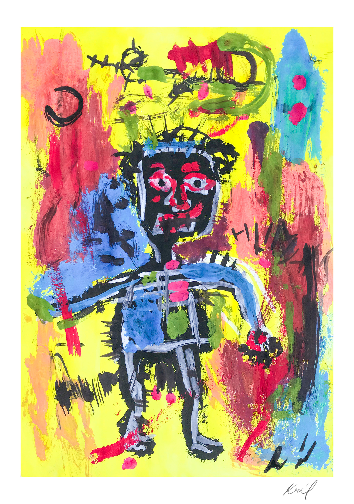
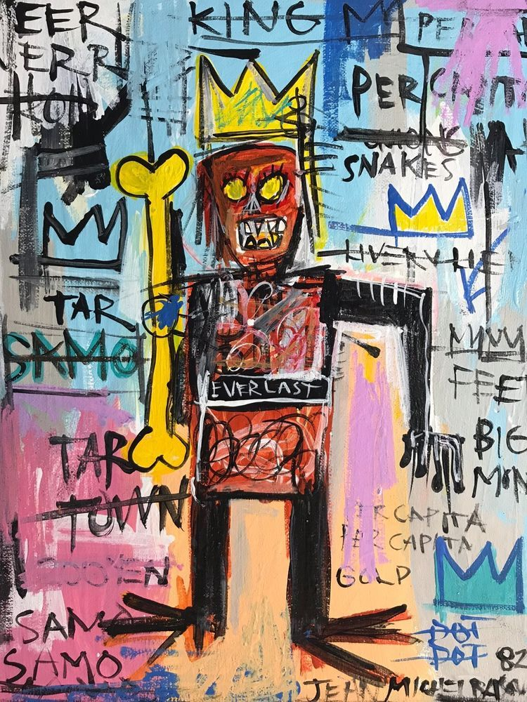
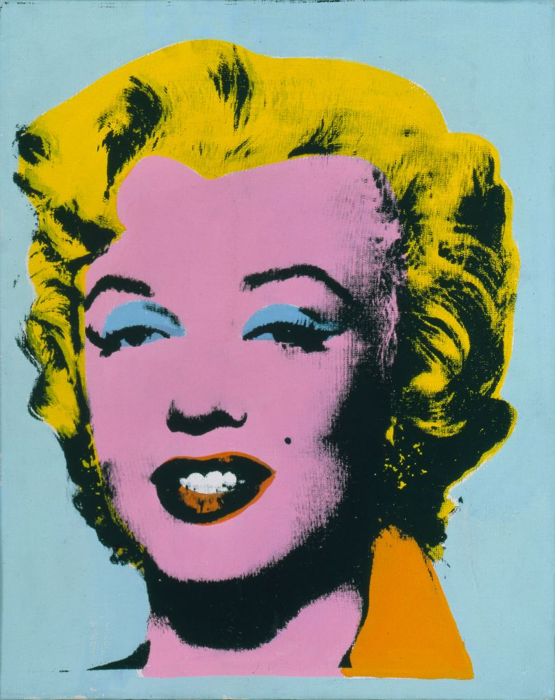
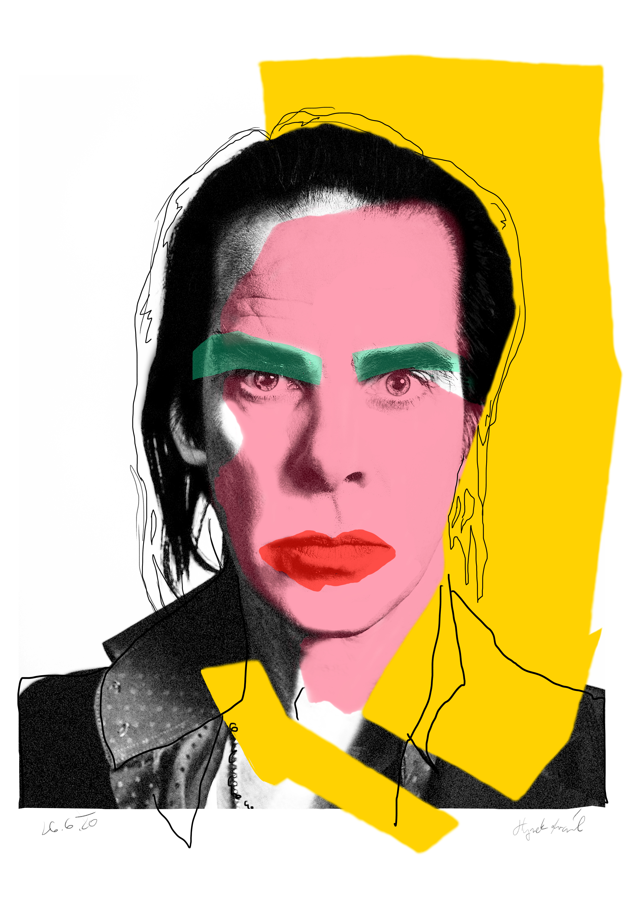

## Chapter VI ##

*If we didn't copy, we wouldn't know anything.*
As children, we start learning new things by copying our parents. We quietly watch them and save the information somewhere deep in our heads. Some abilities are certainly conditioned by instincts, however, as I think, most abilities which aren’t crucial for the satisfaction of living needs we just can’t learn ourselves. Therefore I consider copying to be a kind of human nature. 

It’s the same according to art. When I was younger I always wanted to draw a picture exactly the same as it was in a book. At first, I put a blank paper on a book and outlined a picture that I saw through. Because of that, I was getting better and better. As time went on, I have learned how a dog, a flower, or a human hand looks like. I didn’t have to use the see-through technique anymore. I was just looking at the picture and was drawing what I saw.

Currently, I moved on even further. Because I’ve already learned the basics and I feel like I want to create my own work. Something unique. Naturally I still look up work by other authors, but now, it is not about copying. Now it is about inspiration that I am gaining. I get inspired by colors palette, design style, possibilities of use, but then I keep working on it. I would be truly dissatisfied if I just copied others works. 

In conclusion, copying without specifying the source is, as I hope everyone thinks, dishonest. Nevertheless, soaking up the inspiration and then transforming it into your work, is absolutely fine. Besides, I think it’s almost impossible to come up with an completely new idea. It's more about how we can deal with the gained experiences.

