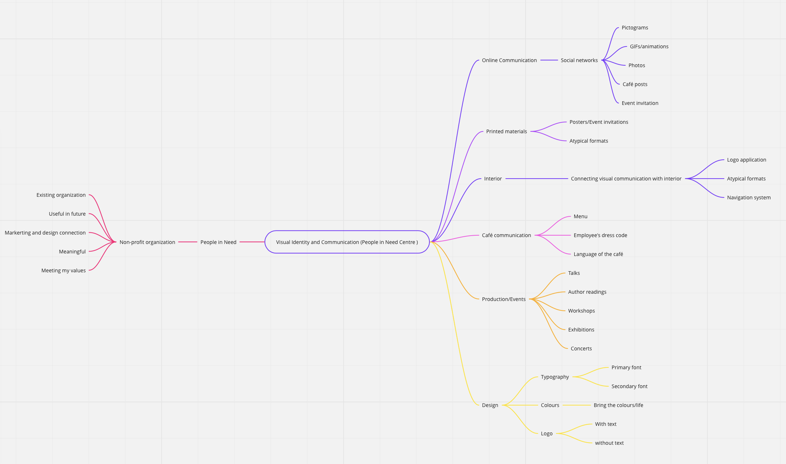

## Corporate identity of People in Need Centre ##

In my Bachelor thesis I am going to create a new visual identity and communication of the Langhans Center, which is a center of People in Need - the largest non-profit organization in Central Europe. It is situated in the very centre of Prague, near the Václavské náměstí. This centre has been operating since 2011 and exists to connect the general public and the organization People in Need. It provides a number of lectures, exhibitions, workshops, screenings, concerts and others in order to educate, enrich and entertain. 

  
Mind Map

### Outline ###
- Centre of People in Need since 2011
- Café, lecture/workshop rooms
- Connecting People in need with general public
- Enriching and entertaining people
- Target group - People who are interested in non-profit organizations, people who care about the world and other people, students
- Analysing the competition, their weaknesses and strengts.
- Talks, workshops, exhibitions

### Voice & Tone
- **Voice** - honest, educated, inspirational
- **Tone** - formal but natural

### Notes

### Keywords

visual communication, graphic design, pictogram, non-profit organization, social networking sites

Corporate identity
* Corporate identity includes the history of the company, philosophy and vision, people belong to the company and its ethical value. 
Corporate Image
* It is an opinion which public have based on behavior of the company

Corporate Culture
* In order to ensure the proper functioning of the entity, it is necessary to maintain a unified corporate culture. This results from the values, thinking, attitudes, behavior and opinions of employees. The employees must share these opinions in order of keeping the proper function of the company.

Corporate Communications
* It represents the complex communication activity of the company, which must be predetermined and must be lead by the same unchanging philosophy.

Corporate design
* Logo
* Colours

### References

czech:Skautský insitut, Kasárny Karlín, Mama coffee, Cafe v lese, Prostor 39, CAMP, Vnitroblock, Kafe Komedie

