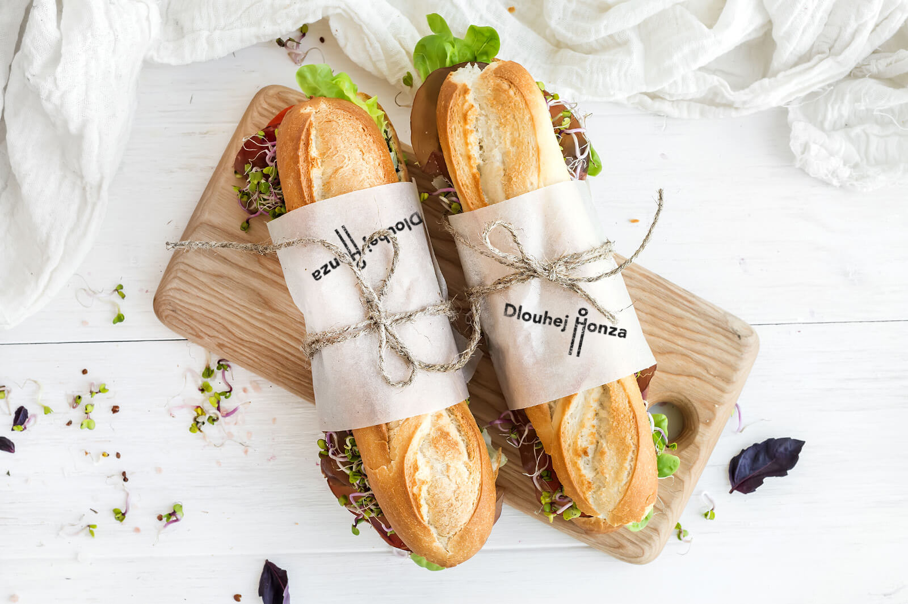
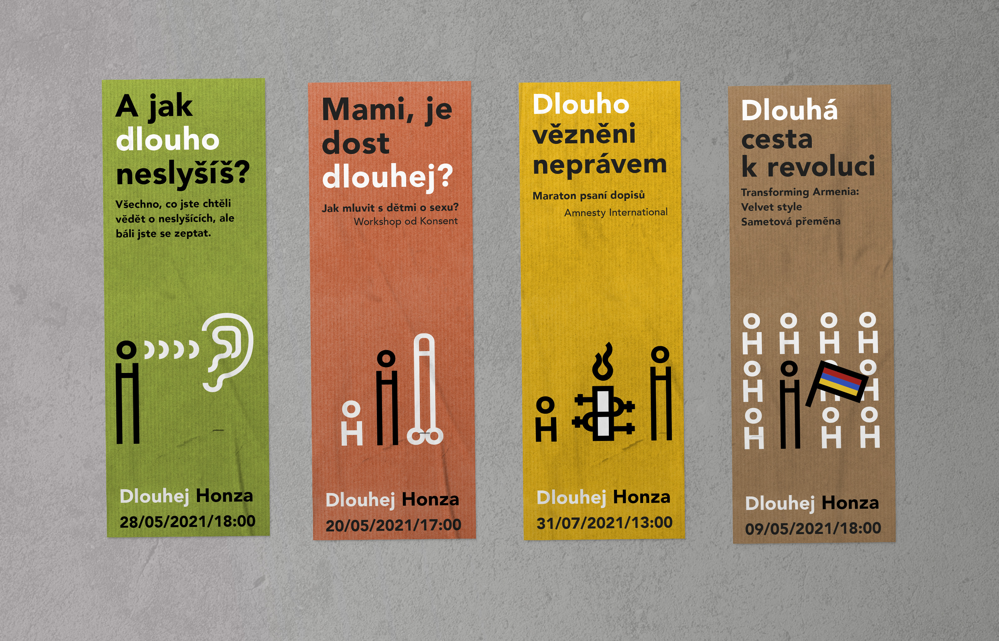

## Abstract

This bachelor's thesis deals with the creation of a visual communication concept for the People in Need Center, the Langhans Center. The thesis contains an explanation of concepts such as corporate identity, logo, typography, pictogram, wayfinding system, color or SWOT analysis.

Besides, it describes the establishment and activities of the non-profit organization People in Need. The work describes the history of the Langhans Palace building, in which the Langhans Center is located, and its reconstruction.

In the practical part of the thesis, an analysis of the current state of the subject is performed and the determined direction by which the visual communication concept will be processed is set. The problem of the naming of the subject and the communication language is solved here as well. It describes the creation of a unified visual style from the design of the logo, color pallete setting, choice of typography, creation of pictograms, to the implementation of these elements in marketing communication.

The aim of the work is to create a comprehensive visual communication concept while bringing attention to the existence of the Langhans Center among the general public. The possible implementation of the new concept should then tap into the space’s potential and make it more attractive. This should then lead to a shift in the public perception of the Langhans Center from being seen as a simple café to serving as a multifunctional space for professionals and ordinary people alike.

Key words: visual communication, graphic design, pictogram, non-profit organization, social networking sites

`The building of Langhans before a reconstruction.`

`The building of Langhans after a reconstruction.`

`The current logo.`

`Current Instagram.`

`Current Facebook.`

`New logo.`

`The communication language - posters.`

`The construction of pictograms.`

`Series of pictograms.`

`The color palette.`

`Stickers on the front door.`

`Wayfinding system - gallery.`

`Wayfinding system - gallery, detail.`

`Toilet signs.`

`Facebook intro.`

`Advertising flag with the logo.`

`New Instagram.`

`Insta.`

`The building of Langhans before reconstruction.`

`Animated pictogram.`

`Animated pictogram.`

`Menu.`

`Tableware design.`

`Coffee cup.`

`Coffee cup.`

`Ducktape with the logo.`

`Snack bag.`

`Apron.`

`The long sandwich.`

`Gingerbreads in the shape of the logo.`

`Black canvas bag with a white design.`

`White canvas bag with a black design.`

`White canvas bag with a colorfull design.`

`Events posters.`

`Event poster with a photo.`

`The Real Gift poster.`

`Facebook event with a photo.`

`Facebook event with a pictogram.`

`Moving wall.`

