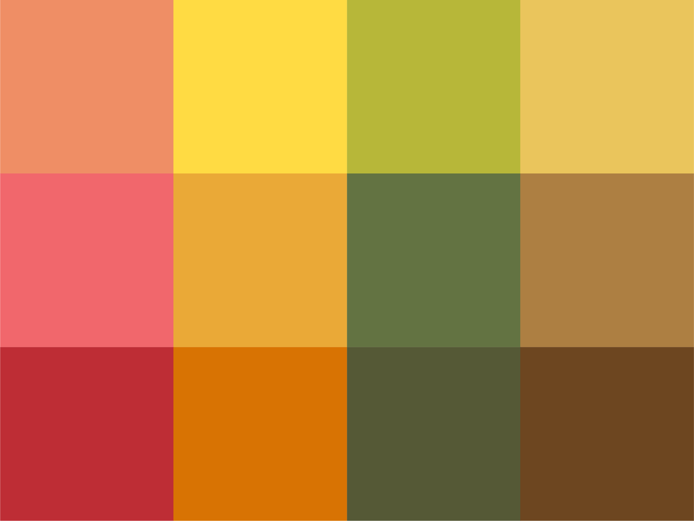
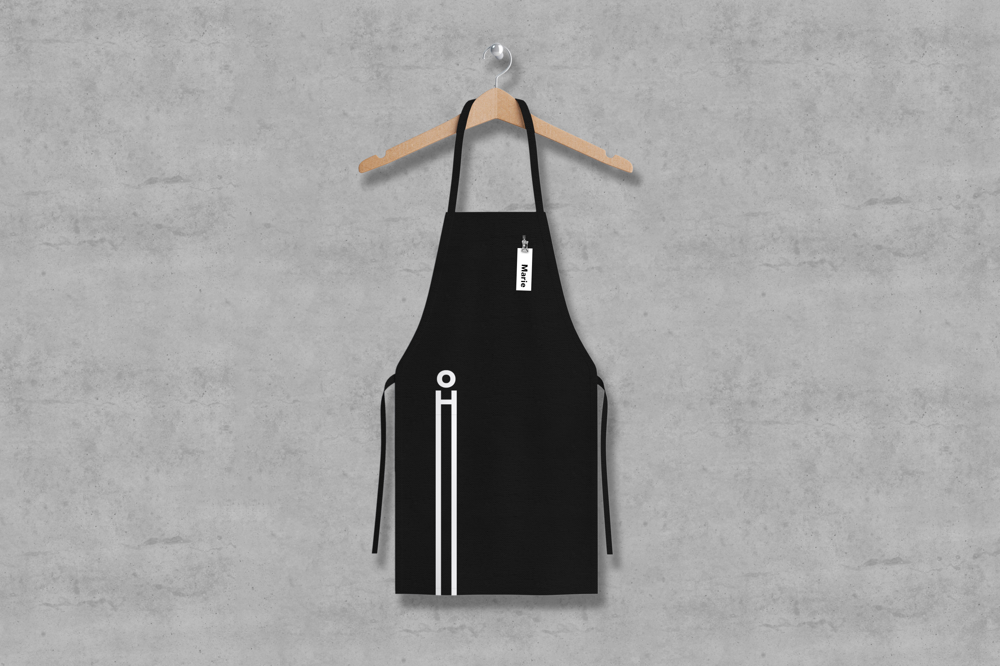
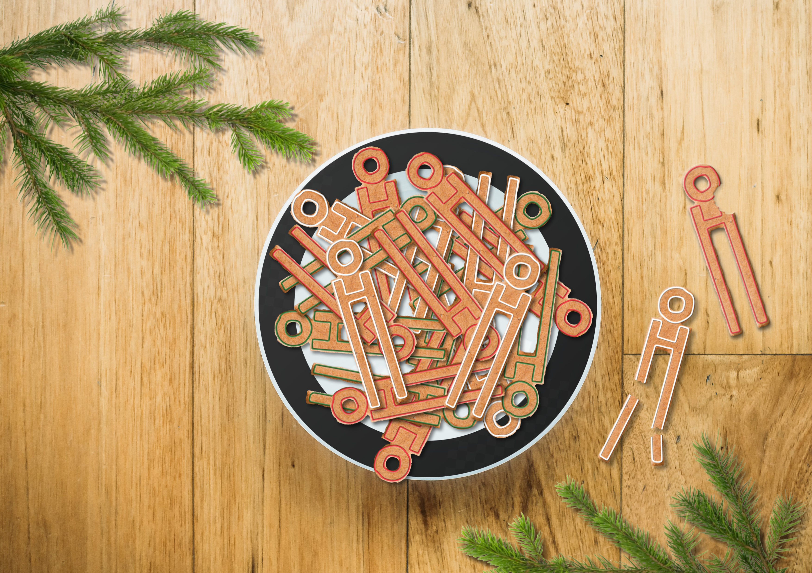

## Abstract

This bachelor's thesis deals with the creation of a visual communication concept for the People in Need Center, the Langhans Center. The thesis contains an explanation of concepts such as corporate identity, logo, typography, pictogram, wayfinding system, color or SWOT analysis.

Besides, it describes the establishment and activities of the non-profit organization People in Need. The work describes the history of the Langhans Palace building, in which the Langhans Center is located, and its reconstruction.

In the practical part of the thesis, an analysis of the current state of the subject is performed and the determined direction by which the visual communication concept will be processed is set. The problem of the naming of the subject and the communication language is solved here as well. It describes the creation of a unified visual style from the design of the logo, color pallete setting, choice of typography, creation of pictograms, to the implementation of these elements in marketing communication.

The aim of the work is to create a comprehensive visual communication concept while bringing attention to the existence of the Langhans Center among the general public. The possible implementation of the new concept should then tap into the space’s potential and make it more attractive. This should then lead to a shift in the public perception of the Langhans Center from being seen as a simple café to serving as a multifunctional space for professionals and ordinary people alike.

Key words: visual communication, graphic design, pictogram, non-profit organization, social networking sites

## The building of the Langhans Palace

Since the 1880, the house at 37 Vodičkova Street in Prague has been associated with photography. It was named after Jan Langhans, a prominent Czech portraitist. He lived in 1851–1928. He studied food chemistry, but his passion for photography was stronger. That is why he established a small studio in Jindřichův Hradec in 1876 .From there, after four years, he moved to Prague, where he founded a portrait studio - Atelier Langhans.

An innovative approach, precise craftsmanship and artistic processing and very strong marketing for its time soon turned the studio into the largest photographic plant in the Czech Republic. Jan Langhans has participated in national and international exhibitions, won many awards, including the Order of the Persian Shah and the King of England. He also became the chairman of the Czech Photographic Association.

In the 1948, Atelier Langhans was nationalized on the basis of a decree on the socialization of services. The then Czechoslovakia thus suffered an enormous cultural loss.
 
After the Velvet Revolution in November 1989, the property was returned to the descendants of Jan Langhans. However, as a result of the socialist government's neglected property care, the family was handed over a completely ruined building.
 

`The building of Langhans before a reconstruction.`

In the years 2001 and 2002 there was a reconstruction according to the design of the architect Ladislav Lábus. The reconstruction achieved a harmonious conection between modern architecture and history.

`The building of Langhans after a reconstruction.`

## Brief
The first and basic step before starting to invent a new visual communication concept was to define a brief.

Therefore I performed a SWOT analysis of the current state. The analysis was conducted in the form of an interview with Filip Chládek, who manages the social networks of the Langhans Center and to whom I was referred.

What are the strengths of the Center?
*Definitely the location, the garden and the space of the building, the magic of the place that I will discover when I walk down the alley. Furthermore, informality, anything can happen here, it has the opportunity to become anything. It is a center in the center where people are centered. Informal development of values, cultivation of personality.*

On the contrary, what are the weaknesses?
*It's under People in Need, it binds us a bit, the prestige and so on. Laziness and little innovation. Selling coffee is no longer enough.*

What are the opportunities?
*Greater innovation, initiative. Pulling forward, inventing something new compared to the competition.*

What are the threats? What are your problems? What problems could occur?
*Closing. Threats to our values. Nothing is happening here, it is losing value. That's not what it was supposed to be anymore.*

Filip Chládek later answered my questions concerning the target group, attendance, use of space, etc. I summarized the answers in the following paragraph.

In the normal operation of the café, visitors are usually over thirty years of age, often employees of nearby offices and pensioners. Some of the customers are probably high school students. The Centre's wish is to gain a clientele of university students and people under the age of thirty.
Advertising and communication is online or directly at the Centre's site for financial reasons.
Following the interview and SWOT analysis, I clarified the situation in which the Langhans Center is currently located and set goals that I would like to achieve during my work.
As part of the visual communication concept, I will create a new visual style that will be representative, but will not be dull. I will create a concept that is modern, not fashionable, so that it will be sustainable. I will design solution for communication on social networks and communication directly in the Center. I will try to point out the potential that the subject hides and I will suggest its development.

## The current Logo and communication

The current logo of the Center is purely typographic and consists of a capital bold inscription *LANGHANS* supplemented by the *CENTER OF PEOPLE IN NEED*, or in the second variant *CAFE IN THE CENTER*. The inscription Langhans is distinctive by the missing upper quarter of the letters and the absence of crossbars at letter *A*. It is defined primarily in white on a almost black background.

`The current logo.`

The logo is the only unifying graphic element of the visual communication of the Langhans Center. It is used as a profile picture on Instagram, Facebook and Twitter. However, even these profile photos are not completely uniform. We can find a black and white variant of the logo only on Twitter, but on the other social networks they are working with a variant where the dark gray background is replaced by a photo of a blue outdoor table. That is why the logo loses its legibility.

The Langhans Center communicates with the public mainly through Instagram, Facebook and Twitter profile. The posts mostly concern the promotion of the café and the products they offer, as well as information on the activities of People in Need and the upcoming events held in the Center. 

Photos are probably taken on the phone, they do not have a sufficient quality and thus do not inspire trust, especially if we are talking about gastronomic posts. The content is not visually unified, the photographs do not carry a constant tonality of colors, which is important to create an overall harmonic impression.

`Current Instagram.`

`Current Facebook.`

## Current name

Currently the name Langhans Center is used. It refers to the tradition of the building and its original owner, photographer Jan Langhans. Although I appreciate his work and the innovative approach of this man and see this naming as a kind of honor, I am not entirely sure of the relevance of using his name in connection with the center of a non-profit organization.

Among other things, I do not consider the name Langhans Center to be easy to remember, especially if the visitor is not familiar with the history of the building or does not know at least the basics of the German language. Another factor in choosing a name change is the bad association that it evokes in me. Based on the name, we could expect more of Center of Jan Langhans, not People in Need.

Therefore, I decided to find a name that will refer to the creditable activities of the organization People in Need, but at the same time it will refer to the already used German name. My goal was to come up with a name that would be memorable, human-friendly, and variable for a whole range of messages of different content with a uniform tonality. For this purpose, I find it appropriate the name to be in the Czech language.

## New name

The new name is based on the name and surname of the original owner of the photo studio - Jan Langhans. If we divide the German surname Langhans into *lang* which means long and *hans* that means John /*Honza*, we find out that the full name of the original owner could be translated as John Long John/*Jan Dlouhý Jan*. For simplicity, I have reduced the translated name only to Long John/*Dlouhej Honza*. 

In this case, the name John/*Honza* refers to a children's literary classic - Czech John/*Český Honza*. 
He is a typical Czech fairy-tale character, a young honest boy with a good heart, who, above all, was never afraid of anything because he had a clear conscience.

In my opinion, John/*Honza*, who selflessly helps both at home and in the world, perfectly corresponds to the philosophy of a non-profit organization. 

## New logo

With the new name I was thinking about a creation of a logo in the form of a mascot - Long John. The obstacle I encountered, was an excessive connection with the fairy-tale John. The mascot was too descriptive, infantile or not appropriate to the subject's idea.

So I was looking for a simpler variant that would not overshadow the idea of the subject, but at the same time would express the idea of the Czech *Honza*. Another requirement was to create a logo that will be variable, playful and unmistakably assignable to the subject.

In the end, after a long sketching process, I decided to use a typographic variant of the logo. The logo consists of the inscription *Dlouhej Honza*, in which the mascot is already included. The mascot is based on the letter H, which represents his body. By stretching the stems of the letter downwards, the legs are created, which give to *Dlouhej Honza* his characteristic height / length. The head is formed by the letter o. Both letters remain in the original ratio.

The logo works in a minimum size of 15 mm that its legibility is not lost. 

`New logo.`

## The communication language

During the creation of the visual communication concept, I tried to achieve a comprehensive output. Therefore, the language of communication follows the visual side of the work and vice versa. 

The starting point of the communication language was the name *Dlouhej Honza*/Long John itself. The word *long* is constantly repeated in the communication, and in combination with the name, it strengthens the awareness of the subject's existence. Whatever the form of the communication is, it is characterized by one distinctive sentence that contains the word *long*. The sentence attracts the attention of the observer. Except that there is also more detailed explanation, for example the name of the upcoming event that will take place at the center.

`The communication language - posters.`

## Pictograms

`The construction of pictograms.`

`Series of pictograms.`

## Color palette

`The color palette.`

## Wayfinding system

`Stickers on the front door.`

`Wayfinding system - gallery.`

`Wayfinding system - gallery, detail.`

`Toilet signs.`

## Communication branches
### 1. Center Dlouhej Honza 

`Facebook intro.`

`Advertising flag with the logo.`

### 2. Café Dlouhej Honza
#### Instagram

`New Instagram.`

`Instagram posts with pictograms.`

`Café Instagram posts.`

`Animated pictogram.`

`Animated pictogram.`

`Menu.`

`Tableware design.`

`Coffee cup.`

`Coffee cup.`

`Ducktape with the logo.`

`Snack bag.`

`Apron.`

`The long sandwich.`

`Gingerbreads in the shape of the logo.`

`Black canvas bag with a white design.`

`White canvas bag with a black design.`

`White canvas bag with a colorfull design.`

### 3. People in Need events

`Events posters.`

`Event poster with a photo.`

`The Real Gift poster.`

`Facebook event with a photo.`

`Facebook event with a pictogram.`

`Moving wall.`

